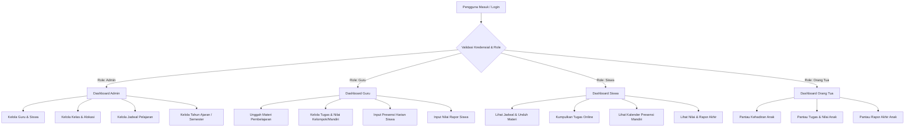
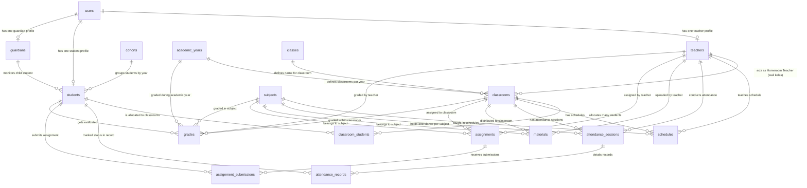

# LAPORAN PENGEMBANGAN APLIKASI PORTAL AKADEMIK SEKOLAH "AKADEMIX"

---

## **LEMBAR COVER LAPORAN**

*   **Nama Mata Kuliah:** Rekayasa Perangkat Lunak / Pemrograman Web Lanjut
*   **Topik Aplikasi:** Sistem Informasi Akademik Sekolah Terintegrasi (AKADEMIX)
*   **Kelas:** XI RPL 1 / IF-44-01 *(Sesuaikan dengan kelas Anda)*
*   **Nama Kelompok:** Kelompok 3 *(Sesuaikan dengan kelompok Anda)*
*   **Daftar Anggota Kelompok:**
    1. **Raka Mahendra** (NIS/NIM: 20240001) - *Front-End & Blade Templating*
    2. **Nadia Putri** (NIS/NIM: 20240002) - *Database Designer & Schema Migration*
    3. **Fajar Ramadhan** (NIS/NIM: 20240003) - *Back-End Developer & Routing Controller*
    4. **Sinta Dewi** (NIS/NIM: 20250001) - *QA Engineer, Tester & Documentation*
*   **Video Presentasi Aplikasi:** [Tonton di YouTube](https://www.youtube.com/watch?v=dQw4w9WgXcQ) *(Silakan sesuaikan dengan link video YouTube kelompok Anda)*
*   **Repositori Kode Program:** [Lihat di GitHub](https://github.com/user/akademix) atau [Akses Google Drive](https://drive.google.com/drive/folders/your-folder-id) *(Silakan sesuaikan dengan link repositori Anda)*

---

## **DAFTAR ISI**
1. [BAB I: PENDAHULUAN](#bab-i-pendahuluan)
   - 1.1 Latar Belakang
   - 1.2 Dasar Permasalahan
2. [BAB II: ANALISA KEBUTUHAN SISTEM](#bab-ii-analisa-kebutuhan-sistem)
   - 2.1 Daftar Pengguna (User Roles)
   - 2.2 Daftar Fitur Utama (Core Features)
3. [BAB III: BAGAN & ANALISA SISTEM](#bab-iii-bagan--analisa-sistem)
   - 3.1 Diagram Alir Sistem (System Architecture/User Flow)
   - 3.2 Entity-Relationship Diagram (ERD)
   - 3.3 Analisa & Statistik Basis Data
4. [BAB IV: STRUKTUR KODE PROGRAM & SCRIPT](#bab-iv-struktur-kode-program--script)
   - 4.1 Struktur Direktori Project Laravel
   - 4.2 Alur Eksekusi Program (Request-Response Lifecycle)
   - 4.3 Contoh Implementasi Kode Esensial
5. [BAB V: DISTRIBUSI PEKERJAAN ANGGOTA](#bab-v-distribusi-pekerjaan-anggota)
   - 5.1 Tabel Anggota Kelompok & Pembagian Kerja

---

## **BAB I: PENDAHULUAN**

### **1.1 Latar Belakang**
Dalam era transformasi digital saat ini, sektor pendidikan dituntut untuk mengadopsi teknologi guna meningkatkan efisiensi dan transparansi manajemen akademik. Banyak sekolah menengah masih menggunakan metode pencatatan manual atau semi-digital berbasis spreadsheet yang tersebar. Proses absensi siswa, pembagian materi pelajaran, pengumpulan tugas, hingga pengolahan nilai rapor sering kali terhambat oleh masalah redundansi data, kehilangan arsip fisik, serta kurangnya akses real-time bagi pihak terkait.

**AKADEMIX** hadir sebagai portal akademik sekolah terintegrasi berbasis kerangka kerja (framework) **Laravel**. Aplikasi ini dirancang khusus untuk memfasilitasi koordinasi empat pilar utama dalam ekosistem sekolah: Administrator/Tata Usaha (TU), Guru, Siswa, dan Orang Tua/Wali Murid. Dengan sistem terpusat, pengolahan data akademik menjadi lebih cepat, akurat, aman, dan dapat diakses dari mana saja.

### **1.2 Dasar Permasalahan**
Beberapa masalah mendasar yang diidentifikasi dari sistem konvensional dan diselesaikan oleh AKADEMIX adalah:
1. **Redundansi dan Fragmentasi Data:** Absensi, materi, tugas, dan nilai disimpan secara terpisah sehingga sulit disinkronisasi.
2. **Keterbatasan Pemantauan Orang Tua:** Orang tua sering kali tidak mengetahui kehadiran harian anak, materi yang sedang dipelajari, maupun tugas yang belum dikerjakan secara langsung.
3. **Ketidakpraktisan Pengumpulan Tugas:** Pengumpulan tugas secara fisik atau melalui chat messenger menyulitkan guru dalam mendokumentasikan tanggal pengumpulan, memberikan umpan balik (feedback), dan mengarsipkan dokumen.
4. **Masalah Penjadwalan Kelas:** Tanpa sistem validasi yang ketat, bentrokan jadwal guru atau pemakaian ruang kelas sering terjadi saat pergantian semester/tahun ajaran baru.

---

## **BAB II: ANALISA KEBUTUHAN SISTEM**

### **2.1 Daftar Pengguna (User Roles)**
Aplikasi ini memiliki 4 kategori pengguna yang diotorisasi berdasarkan *role-based access control* (RBAC):

1. **Administrator / Staf Tata Usaha (TU):**
   * Bertanggung jawab atas pengelolaan data master institusi, pendaftaran pengguna (guru, siswa, wali kelas), alokasi siswa ke kelas masing-masing, pengelolaan jadwal mata pelajaran, dan konfigurasi tahun akademik/semester aktif.
2. **Guru (Teacher):**
   * Bertindak sebagai penyedia materi pembelajaran, pembuat dan pemeriksa tugas, pencatat absensi siswa di kelas yang diajar, serta penginput nilai (harian, tugas, rapor).
3. **Siswa (Student):**
   * Pengguna yang dapat melihat jadwal pelajaran, mengunduh materi belajar, mengumpulkan tugas secara online, memantau rekap absensi diri, serta melihat hasil nilai rapor.
4. **Orang Tua / Wali Murid (Parent):**
   * Memiliki akses terbatas untuk memantau performa akademik anak secara real-time, meliputi kehadiran harian anak, daftar tugas beserta nilainya, dan rapor akhir semester.

### **2.2 Daftar Fitur Utama (Core Features)**

*   **Sistem Autentikasi Unik:**
    * Login konvensional menggunakan *username* dan *password* untuk Admin, Guru, dan Siswa.
    * Login khusus untuk Orang Tua menggunakan **NIS (Nomor Induk Siswa)** anak sebagai kredensial autentikasi dengan password akun orang tua. Sistem otomatis mengaitkan session orang tua dengan profil siswa tersebut (`active_student_id`).
*   **Modul Admin:**
    * CRUD Akun Guru, Siswa, dan Wali Murid.
    * CRUD Ruang Kelas & Alokasi Penempatan Siswa (*Student Assignment to Classroom*).
    * CRUD Jadwal Pelajaran (*Schedules*) per Kelas dengan validasi hari, waktu mulai, dan waktu selesai.
    * Pengelolaan Tahun Ajaran dan Aktivasi Semester (Ganjil/Genap) beserta fungsi arsip semester lampau.
*   **Modul Guru:**
    * CRUD Materi Pembelajaran (*Materials*) dengan opsi unggah lampiran file pendukung.
    * CRUD Tugas Sekolah (*Assignments*) lengkap dengan deskripsi, tanggal batas akhir pengumpulan (*due date*), dan unduh berkas tugas.
    * Penilaian Tugas Siswa (*Submissions Grading*) secara online beserta kolom catatan umpan balik (*feedback*).
    * Pencatatan Absensi Harian Siswa (*Attendance Logging*) per pertemuan mata pelajaran dengan pilihan status: Hadir, Izin, Sakit, atau Alpha.
    * Manajemen Nilai Akademik (*Grades*) untuk nilai harian, nilai tugas, dan nilai rapor akhir.
*   **Modul Siswa:**
    * Visualisasi Dashboard yang menampilkan Jadwal Pelajaran Hari Ini secara dinamis.
    * Unduh Materi Pelajaran yang diunggah oleh guru di kelasnya.
    * Upload Berkas Tugas (*Assignment Submission*) dengan dukungan berbagai format file (PDF, DOCX, ZIP, gambar) dan keterangan teks.
    * Rekapitulasi Presensi dalam bentuk grid kalender bulanan interaktif.
    * Halaman Rapor Nilai Akhir Semester.
*   **Modul Orang Tua:**
    * Dashboard pemantauan statistik cepat terkait akumulasi ketidakhadiran anak (Izin, Sakit, Alpha).
    * Monitoring Kalender Kehadiran anak per bulan.
    * Monitoring Riwayat Nilai Tugas & Umpan Balik Guru.
    * Tampilan Rapor Nilai Akhir Semester Anak.

---

## **BAB III: BAGAN & ANALISA SISTEM**

### **3.1 Diagram Alir Sistem (System Architecture/User Flow)**
Berikut adalah diagram alir navigasi berdasarkan pembagian hak akses pengguna di aplikasi AKADEMIX:



### **3.2 Entity-Relationship Diagram (ERD)**
Struktur relasi antar-tabel dalam database `akademix_2` digambarkan sebagai berikut:



### **3.3 Analisa & Statistik Basis Data**
Berdasarkan data yang diimpor ke dalam sistem database aplikasi (`akademix2.sql`), berikut adalah rincian metrik jumlah data aktif saat ini:

| Entitas Data / Tabel | Estimasi Jumlah Data | Deskripsi Keterangan |
| :--- | :---: | :--- |
| **Users** | ~324 akun | Menyimpan seluruh akun terdaftar (Admin, Guru, Siswa, Orang Tua) |
| **Students (Siswa)** | ~305 siswa | Siswa terdaftar aktif dari berbagai angkatan (*cohort*) |
| **Classrooms (Rombel)** | 19 rombel | Pembagian ruang kelas berdasarkan tingkat (10, 11, 12) |
| **Classroom Students** | ~314 alokasi | Relasi penempatan siswa di kelas sesuai tahun ajaran |
| **Schedules (Jadwal)** | ~300 baris | Jadwal mata pelajaran harian di kelas-kelas |
| **Grades (Nilai)** | ~74 entri | Arsip pencatatan nilai tugas, harian, dan nilai rapor akhir |
| **Attendance Records** | ~132 presensi | Catatan detail status presensi (Hadir, Izin, Sakit, Alpha) |
| **Assignments & Materials**| ~44 berkas | Dokumen tugas dan materi yang diunggah guru |

#### **Diagram Analisa Distribusi Peran Pengguna (Users Role Breakdown)**
```text
Siswa       : ▓▓▓▓▓▓▓▓▓▓▓▓▓▓▓▓▓▓▓▓▓▓▓▓▓▓▓▓▓▓▓▓▓▓▓▓▓▓▓▓▓▓▓▓▓▓▓▓▓▓ (~94.1%) [305 akun]
Guru        : ▓▓ (~4.6%) [15 akun]
Orang Tua   : ▓ (~0.9%) [3 akun]
Admin       : ░ (<0.3%) [1 akun]
```

---

## **BAB IV: STRUKTUR KODE PROGRAM & SCRIPT**

### **4.1 Struktur Direktori Project Laravel**
Aplikasi AKADEMIX menggunakan struktur standar MVC (*Model-View-Controller*) dari Laravel. Berikut adalah file dan direktori krusial yang menopang logika sistem:

```text
akademix_new/
├── app/
│   ├── Http/
│   │   ├── Controllers/
│   │   │   ├── AuthController.php          <-- Logika login multi-role & wali murid
│   │   │   ├── AdminController.php         <-- Dashboard admin
│   │   │   ├── TeacherController.php       <-- Dashboard guru
│   │   │   ├── StudentController.php       <-- Dashboard siswa & wali murid (kalender & tugas)
│   │   │   ├── ParentController.php        <-- Integrasi monitoring untuk orang tua
│   │   │   └── Admin/ (Sub-folder)         <-- CRUD Kontroler khusus panel Admin
│   │   │   └── Teacher/ (Sub-folder)       <-- CRUD Kontroler penugasan, presensi, & nilai
│   │   └── Middleware/
│   │       └── RoleMiddleware.php          <-- Proteksi route berdasarkan otorisasi peran
│   └── Models/
│       ├── User.php                        <-- Relasi model pengguna & hashing password
│       ├── Student.php                     <-- Relasi biodata siswa & penempatan kelas
│       ├── Teacher.php                     <-- Relasi biodata guru & mata pelajaran
│       ├── Guardian.php                    <-- Relasi biodata orang tua & siswa asuh
│       ├── Classroom.php                   <-- Manajemen rombongan belajar
│       ├── Schedule.php                    <-- Data jadwal harian kelas
│       ├── AttendanceRecord.php            <-- Detail presensi per siswa
│       ├── Assignment.php                  <-- Data tugas sekolah
│       └── Grade.php                       <-- Rekap nilai harian & rapor
├── config/                                 <-- Berkas konfigurasi (database, mail, session)
├── database/
│   ├── migrations/                         <-- Struktur skema database Laravel
│   └── seeders/                            <-- Pengisi data awal (seeder) database
├── resources/
│   └── views/                              <-- Template visual antarmuka (Blade engine)
│       ├── layouts/                        <-- Tata letak utama dashboard (dashboard.blade.php)
│       ├── admin/                          <-- Tampilan CRUD panel Admin
│       ├── teacher/                        <-- Tampilan input guru (tugas, absensi, nilai)
│       ├── student/                        <-- Tampilan modul belajar siswa
│       ├── parent/                         <-- Tampilan dashboard monitoring orang tua
│       └── auth/                           <-- Halaman login terpadu
└── routes/
    └── web.php                             <-- Berkas pemetaan URL Routing utama
```

### **4.2 Alur Eksekusi Program (Request-Response Lifecycle)**
Logika eksekusi web portal ini berjalan di bawah alur lifecycle Laravel sebagai berikut:
1. **HTTP Request:** Pengguna mengakses URL (contoh: `/student/assignments` untuk melihat daftar tugas).
2. **Routing:** Berkas [routes/web.php](file:///d:/laragon/www/akademix_new/routes/web.php) mengidentifikasi kecocokan URL dan memeriksa middleware `auth` serta `role:student`.
3. **Middleware Otorisasi:** [RoleMiddleware.php](file:///d:/laragon/www/akademix_new/app/Http/Middleware/RoleMiddleware.php) memvalidasi apakah pengguna yang sedang login benar memiliki role `student`. Jika valid, request diteruskan.
4. **Controller Processing:** [StudentController.php](file:///d:/laragon/www/akademix_new/app/Http/Controllers/StudentController.php) memanggil method `assignments()`. Controller ini meminta data profil siswa, kelas aktif, data mata pelajaran, materi, serta status tugas yang sudah dikumpulkan dari database.
5. **Eloquent ORM:** Model `Student`, `Assignment`, dan `AssignmentSubmission` menarik data secara efisien menggunakan query builder Eloquent.
6. **Blade View Rendering:** Controller mengembalikan data ke view `student.assignments.index` dan dirender sebagai kode HTML lengkap menggunakan font *Inter*, kerangka tata letak *Academic Blue*, serta tabel responsif.
7. **HTTP Response:** HTML dikirim kembali ke browser pengguna.

### **4.3 Contoh Implementasi Kode Esensial**

#### **1. Otorisasi Login Dinamis & Login Orang Tua Menggunakan NIS Siswa**
Potongan kode berikut diambil dari [AuthController.php](file:///d:/laragon/www/akademix_new/app/Http/Controllers/AuthController.php#L17-L51) yang menangani otentikasi ganda (autentikasi standar & autentikasi wali murid menggunakan NISN):

```php
public function login(Request $request)
{
    $credentials = $request->validate([
        'username' => 'required|string',
        'password' => 'required|string',
    ]);

    $usernameInput = $credentials['username'];
    $passwordInput = $credentials['password'];

    // 1. Percobaan login standar (Admin, Guru, Siswa menggunakan username terdaftar)
    if (Auth::attempt(['username' => $usernameInput, 'password' => $passwordInput, 'is_active' => 1])) {
        $request->session()->regenerate();
        return $this->redirectBasedOnRole(Auth::user());
    }

    // 2. Percobaan login Orang Tua menggunakan NISN Siswa (anaknya)
    $student = Student::where('nis', $usernameInput)->first();
    if ($student && $student->guardian_id) {
        $guardianUser = $student->guardian->user;
        if ($guardianUser && $guardianUser->is_active) {
            // Verifikasi password orang tua terhadap akun user guardian
            if (Auth::attempt(['username' => $guardianUser->username, 'password' => $passwordInput])) {
                $request->session()->regenerate();
                // Simpan ID Siswa (anak) ke session untuk konteks monitoring orang tua
                session(['active_student_id' => $student->id]);
                return $this->redirectBasedOnRole(Auth::user());
            }
        }
    }

    return back()->withErrors([
        'username' => 'Username/NISN atau Password salah.',
    ])->onlyInput('username');
}
```

#### **2. Pengumpulan Tugas Siswa dengan Dukungan Multi-attachment**
Logika pemrosesan unggahan file tugas oleh siswa dari [StudentController.php](file:///d:/laragon/www/akademix_new/app/Http/Controllers/StudentController.php#L205-L262):

```php
public function submitAssignment(Request $request, Assignment $assignment)
{
    $student = $this->getStudentProfile();
    // Validasi otorisasi (orang tua tidak boleh mengumpulkan tugas)
    if (auth()->user()->role === 'parent') {
        return back()->withErrors(['error' => 'Orang tua hanya dapat melihat tugas.']);
    }

    $request->validate([
        'content'       => 'nullable|string',
        'attachments'   => 'nullable|array|max:10',
        'attachments.*' => 'file|mimes:pdf,doc,docx,jpg,png,zip,rar|max:20480',
    ]);

    $existing = AssignmentSubmission::where('assignment_id', $assignment->id)
        ->where('student_id', $student->id)->first();

    $existingPaths = $existing->attachment ?? [];

    // Menyimpan file lampiran baru ke dalam storage disk public
    if ($request->hasFile('attachments')) {
        foreach ($request->file('attachments') as $file) {
            $existingPaths[] = $file->storeAs('submissions', uniqid() . '---' . $file->getClientOriginalName(), 'public');
        }
    }

    AssignmentSubmission::updateOrCreate(
        ['assignment_id' => $assignment->id, 'student_id' => $student->id],
        [
            'content'      => $request->content ?? '',
            'status'       => 'submitted',
            'submitted_at' => now(),
            'attachment'   => empty($existingPaths) ? null : $existingPaths,
        ]
    );

    return redirect()->route('student.assignments.show', $assignment->id)->with('success', 'Tugas berhasil dikumpulkan.');
}
```

---

## **BAB V: DISTRIBUSI PEKERJAAN ANGGOTA**

### **5.1 Tabel Anggota Kelompok & Pembagian Kerja**

Berikut adalah tabel rincian kontribusi masing-masing anggota kelompok dalam pengembangan aplikasi AKADEMIX:

| No | Nama Anggota | NIM / NIS | Peran Utama | Rincian Pekerjaan & Fitur yang Dikerjakan |
| :-: | :--- | :---: | :---: | :--- |
| 1 | **Raka Mahendra** | 20240001 | Front-End & UI Designer | <ul><li>Merancang dan membangun template layouts dashboard utama (`resources/views/layouts/dashboard.blade.php`).</li><li>Mengintegrasikan font *Inter* dan skema warna *Academic Blue* di CSS.</li><li>Menyusun tampilan kalender kehadiran siswa interaktif di modul presensi.</li><li>Membuat UI form CRUD dan tata letak tabel presensi guru.</li></ul> |
| 2 | **Nadia Putri** | 20240002 | Database Specialist | <ul><li>Merancang arsitektur database `akademix_2` dan menyusun relasi tabel (ERD).</li><li>Menulis file migrasi database dan script seeder data uji coba.</li><li>Memperbaiki masalah integritas data foreign key pada skema migrasi tabel `classrooms` dan `grades`.</li><li>Menyusun query statistik rekap kehadiran untuk dashboard orang tua.</li></ul> |
| 3 | **Fajar Ramadhan** | 20240003 | Back-End Developer | <ul><li>Mengembangkan sistem autentikasi multi-role terpadu dan fitur login wali murid berbasis NIS.</li><li>Membangun route controller CRUD admin (kelola data guru, siswa, kelas, jadwal).</li><li>Mengimplementasikan fitur unggah materi, tugas, absensi, dan penilaian di panel guru.</li><li>Menulis logika alokasi otomatis penempatan siswa ke kelas.</li></ul> |
| 4 | **Sinta Dewi** | 20250001 | QA Engineer & Doc | <ul><li>Melakukan pengujian black-box testing terhadap hak akses middleware masing-masing role.</li><li>Menguji ketahanan fitur unggah berkas tugas (file upload validation).</li><li>Menulis dokumentasi teknis sistem (`DESIGN.md` & `README.md`).</li><li>Menyusun laporan akhir proyek dan mempersiapkan materi video presentasi YouTube.</li></ul> |

---
*Laporan ini disusun dengan sebenar-benarnya untuk memenuhi tugas mata kuliah Rekayasa Perangkat Lunak.*
